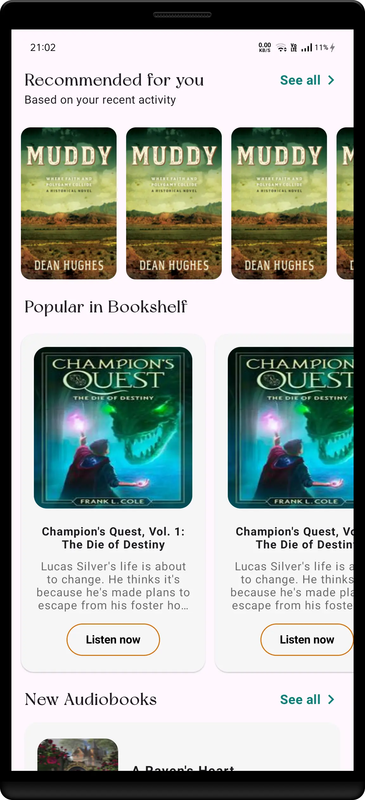
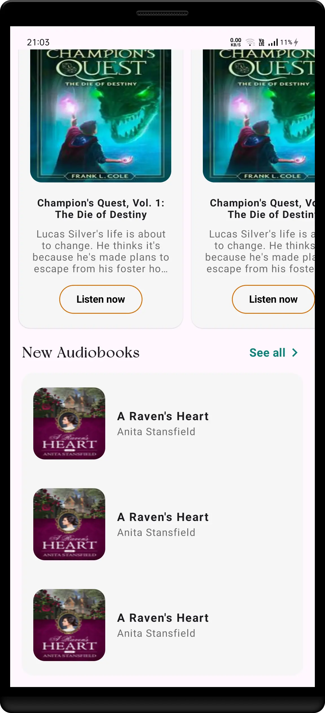

# Practical Task (Bookies)

This Android application fetches discovery data from an API, caches it locally, and displays it using Jetpack Compose based on a provided Figma design.

## 🛠 Features

- API integration using Retrofit
- Local caching using DataStore
- 2-hour cache validity logic
- Jetpack Compose UI with ViewModel (MVC)
- Coil image loading
- Error handling and loading states
- Figma design implementation
- Swipe refresh for data

## 🧠 Architecture

This app follows a clean MVC architecture to separate concerns and ensure testability.

- **MVC Pattern** with `ViewModel` and `StateFlow`
- **Repository Layer** abstracts data source logic
- **DataStoreManager** is used for caching JSON + timestamp
- **Retrofit** handles network operations


## 🖼 UI Design

This app implements the provided Figma design:  
[Figma Link](https://www.figma.com/design/uqkkO4wVkMGS8w7OHZ7y0N/Untitled?node-id=4-207&t=9ry1k3D1zkd48MgM-0)

## 🔧 Setup Instructions

1. Clone the repository:
   ```bash
   git clone https://github.com/your-username/practical-jetpack-compose.git
   ```

2. Open in Android Studio.
3. Add `base.url` in `local.properties`.
4. Build and run on any Android emulator or device.

## 📁 Folder Structure

```
├── components (common UI)
├── model (data classes)
├── network (Retrofit service)
├── repository (data flow logic)
├── data
│   └── cache (Datastore cache)
├── ui (Color & theme)
├── screen (Composable UI)
│   └── home 
├── viewmodel 
├── MainActivity.kt
├── ARCHITECTURE.md
└── README.md

```

## ⚠ Challenges & Solutions

| Challenge                  | Solution                                                           |
|----------------------------|--------------------------------------------------------------------|
| Efficient cache validation | Stored timestamp using DataStore and compared against current time |
| Figma UI implementation    | Used Compose components like LazyColumn, Card, Coil image loading  |
| API integration            | Used Retrofit with Gson converter                                  |
| Local storage              | Used DataStore for simplicity and performance                      |

## 🖼 Screenshots
**Note:** Due to limited data resource, same data will be displayed multiple times.

|                             First Half                             |                           Second Half                           |                             Final                              |
|:------------------------------------------------------------------:|:---------------------------------------------------------------:|:--------------------------------------------------------------:|
|  |  |  |